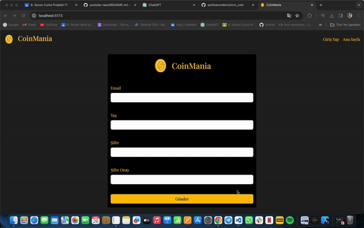

# React + Vite

This template provides a minimal setup to get React working in Vite with HMR and some ESLint rules.

Currently, two official plugins are available:

- [@vitejs/plugin-react](https://github.com/vitejs/vite-plugin-react/blob/main/packages/plugin-react/README.md) uses [Babel](https://babeljs.io/) for Fast Refresh
- [@vitejs/plugin-react-swc](https://github.com/vitejs/vite-plugin-react-swc) uses [SWC](https://swc.rs/) for Fast Refresh

# mvc_coin

Heyecanla duyurmak istediğim bir haberim var! React ve MVC yapısıyla geliştirdiğimiz yeni coin izleme uygulamamızla karşınızdayız! Bu uygulama, kullanıcıların istedikleri kripto para birimlerinin tüm bilgilerine erişebileceği ve son bir yıllık değişimlerini gözlemleyebileceği bir platform sunuyor.

➡️ API Verileriyle Gerçek Zamanlı İzleme: Axios ile API istekleri atarak, kullanıcılar istedikleri coin'in anlık verilerine erişebilirler. Bu sayede piyasadaki güncel gelişmeleri takip edebilirler.

➡️ React Router DOM ile Sayfalama Yapısı: React Router DOM kullanarak, kullanıcılar kolayca uygulama içinde gezinebilirler. Coinler arasında hızlıca geçiş yapmak ve detaylı bilgilere erişmek artık çok daha kolay!

➡️ Bootstrap ile Responsive Tasarım: Bootstrap'in sağladığı güçlü grid sistemi ve bileşenleri sayesinde, uygulamamız her türlü cihazda mükemmel bir görünüm sunuyor. Mobil cihazlarda da rahatlıkla kullanılabilir.

➡️ Ekstra Özellikler: Formik ile kullanıcı dostu formlar, Chart.js ve React-Chartjs-2 ile interaktif grafikler, Millify ile sayıların okunabilir hale getirilmesi, React Icons ile ikon desteği, React-Toastify ile bildirimler ve Yup ile form doğrulaması gibi ekstra özelliklerle uygulamamızı daha da güçlendirdik.

# screenshot

